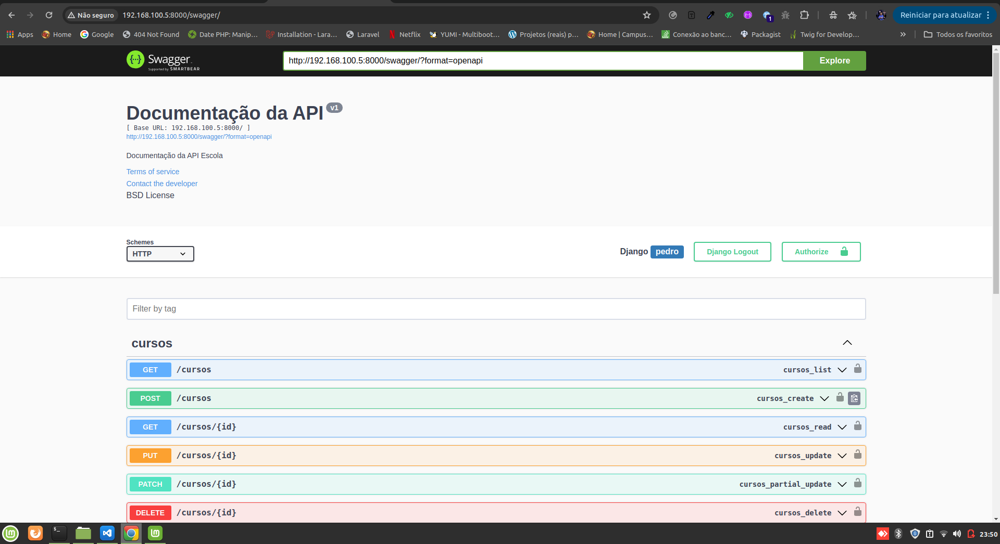
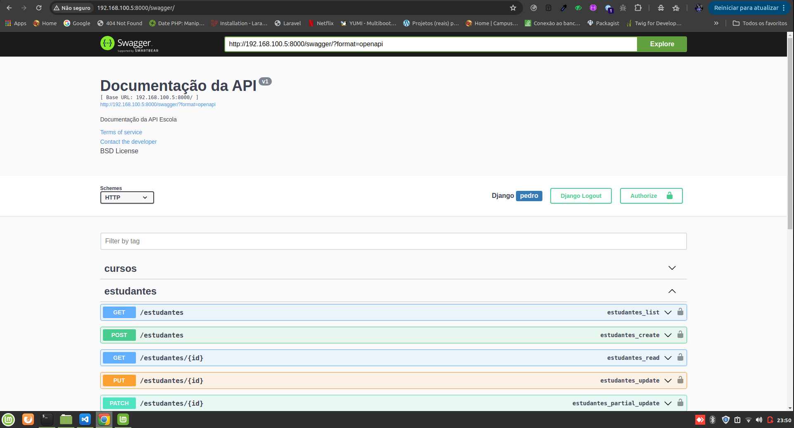
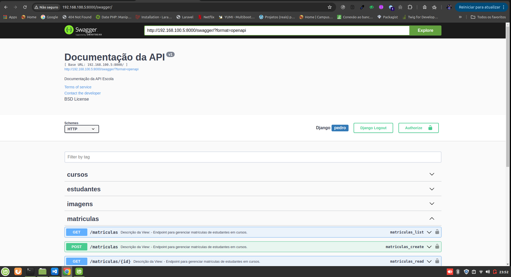

# 🎓 Django REST API - Courses, Students, and Enrollments

This project is a **Django REST Framework (DRF)** application for managing **courses, students, and enrollments**.  
It includes a fully interactive **Swagger UI** for exploring and testing the API endpoints.

---

## 🚀 Features

- CRUD for **Courses**
- CRUD for **Students**
- CRUD for **Enrollments**
- **Swagger UI** and **ReDoc** auto-generated documentation
- **CORS** enabled for front-end integrations
- Organized and maintainable RESTful architecture

---

## 🧩 Tech Stack

| Component                 | Version |
| ------------------------- | ------- |
| **Python**                | 3.11.5  |
| **Django**                | 5.1.7   |
| **Django REST Framework** | 3.15.2  |
| **drf-yasg (Swagger)**    | 1.21.11 |
| **django-cors-headers**   | 4.9.0   |
| **django-filter**         | 25.1    |
| **Faker**                 | 37.6.0  |
| **pillow**                | 11.3.0  |
| **validate-docbr**        | 1.11.1  |

All dependencies are listed in the `requirements.txt` file.

---

## ⚙️ Installation & Setup

### 1️⃣ Clone this repository

```bash
git clone https://github.com/yourusername/django-rest-courses-api.git
cd django-rest-courses-api
```

### 2️⃣ Create and activate a virtual environment

```bash
python -m venv venv
source venv/bin/activate      # On Windows: venv\Scripts\activate
```

### 3️⃣ Install dependencies

```bash
pip install -r requirements.txt
```

### 4️⃣ Apply database migrations

```bash
python manage.py migrate
```

### 5️⃣ Run the development server

```bash
python manage.py runserver
```

### 6️⃣ Access the project in your browser

```
http://127.0.0.1:8000/
```

### 7️⃣ Open the Swagger documentation

```
http://127.0.0.1:8000/swagger/
```

---

## 🧠 API Overview

| Resource        | Method | Endpoint            | Description                  |
| --------------- | ------ | ------------------- | ---------------------------- |
| **Courses**     | GET    | `/cursos/`          | List all courses             |
|                 | POST   | `/cursos/`          | Create a new course          |
|                 | GET    | `/cursos/{id}/`     | Retrieve a specific course   |
|                 | PUT    | `/cursos/{id}/`     | Update a course              |
|                 | DELETE | `/cursos/{id}/`     | Delete a course              |
| **Students**    | GET    | `/estudantes/`      | List all students            |
|                 | POST   | `/estudantes/`      | Create a new student         |
|                 | GET    | `/estudantes/{id}/` | Retrieve a student           |
|                 | PUT    | `/estudantes/{id}/` | Update a student             |
|                 | DELETE | `/estudantes/{id}/` | Delete a student             |
| **Enrollments** | GET    | `/matriculas/`      | List all enrollments         |
|                 | POST   | `/matriculas/`      | Enroll a student in a course |
|                 | GET    | `/matriculas/{id}/` | Retrieve enrollment details  |
|                 | DELETE | `/matriculas/{id}/` | Cancel enrollment            |

---

## 🧪 Example Request (Course Creation)

```json
POST /courses/
{
  "title": "Python for Beginners",
  "description": "A complete introduction to Python programming.",
  "duration": "40 hours"
}
```

---

## 🖼️ Swagger UI Screenshots

### 📘 Courses Endpoints



### 🎓 Students Endpoints



### 🧾 Enrollments Endpoints



_(Place your screenshots in the `/docs` folder of your project.)_

---

## 🧰 Useful Django Commands

```bash
# Run server
python manage.py runserver

# Create a superuser
python manage.py createsuperuser

# Apply migrations
python manage.py makemigrations
python manage.py migrate
```

---

## 🔧 CORS Configuration (for front-end integration)

In your `settings.py`, make sure you have:

```python
INSTALLED_APPS = [
    ...
    'corsheaders',
    'rest_framework',
    'drf_yasg',
]

MIDDLEWARE = [
    'corsheaders.middleware.CorsMiddleware',
    'django.middleware.common.CommonMiddleware',
    ...
]

CORS_ALLOWED_ORIGINS = [
    "http://localhost:8042",      # React app or front-end address
    "http://192.168.100.31:8042", # Local network access
]
```

---

## 📜 License

This project is distributed under the **MIT License**.  
You are free to use, modify, and distribute it for learning or production purposes.
